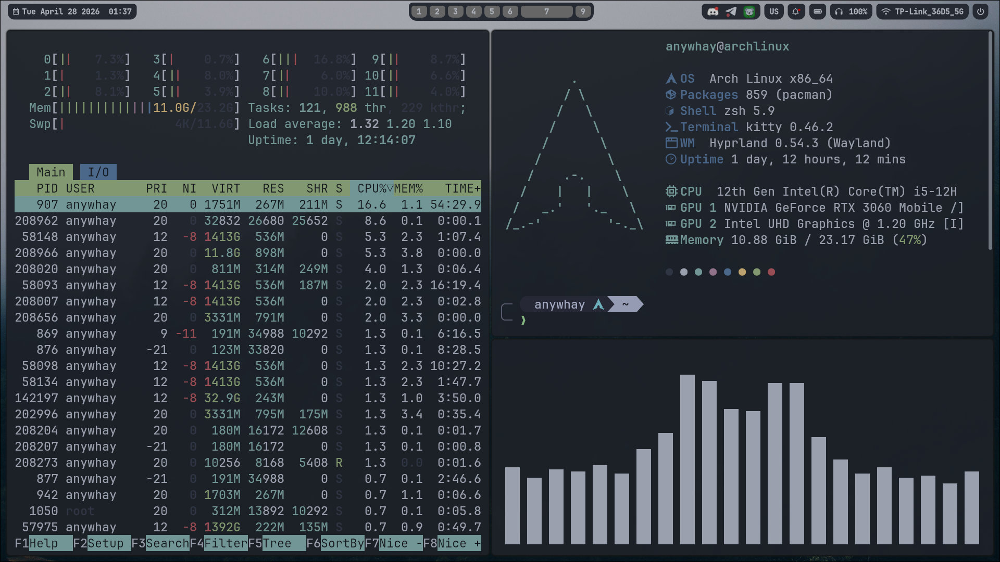

# My dotfiles

In this repository I want to share with you my dotfiles that form the basis of my rice.The key idea of this rice is minimalism and neatness.


## Features of the project

- **Easy installation**: To get started quickly, clone the repository and use the GNU Stow utility to create the necessary symlinks.
- **Compatibility**: Works flawlessly regardless of the technical components of the device.

## Screenshot gallery




## Main components

- **Window manager**: Hyprland
- **Display manager**: Sddm
- **Terminal**: Kitty
- **Shell**: Zsh
- **Lock screen**: Hyprlock
- **Walpaper backend**: awww
- **Colorpicker**: Hyprpicker
- **Screenshot**: Grim + Slurp + Swappy
- **File manager**: Thunar
- **Power menu, app launcher**: Rofi
- **Taskbar**: Waybar
- **Notifications**: Swaync
- **Fetch**: Fastfetch

## Compatibility

### Linux distribution

As for now, this installer is only made for Arch and its-based distributions. Support of any other distributions is not planned yet.

### Device type

- Desktop ✅
- Laptop ✅

### GPU vendor

- AMD ✅ (not tested)
- Nvidia ✅
- Intel ✅

## How to install

> Installation can take from 10 to 30 minutes with archinstall or 5 to 15 without. Correction: This repository is not a full-fledged project. It only stores dotfiles. To use them successfully, you need uset uttility "GNU Stow"

### 1. Install Git, Stow

```
sudo pacman -S git, stow
```
### 2. Сlone repository

```
git clone https://github.com/TimurSharipovv/hyprland_dots.git 
```
### 3. Move to dotfiles

```
cd dotfiles
```
### 4. Create simlinks with stow.

```
stow .
```


